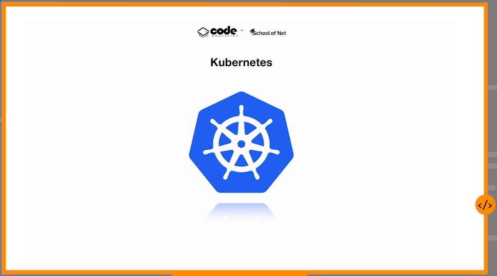

# Kubernetes

Created: April 18, 2024 3:09 PM

# Introdução




# Instalando Kind

www.kind.sigs.k8s.io

## Passo-a-Passo

- Instalar o Kubectl
    - Client para acessar o kubernete
    
    ```bash
    curl -LO "https://dl.k8s.io/release/$(curl -L -s https://dl.k8s.io/release/stable.txt)/bin/linux/amd64/kubectl"
    curl -LO "https://dl.k8s.io/release/$(curl -L -s https://dl.k8s.io/release/stable.txt)/bin/linux/amd64/kubectl.sha256"
    echo "$(cat kubectl.sha256)  kubectl" | sha256sum --check
    # Se válido kubectl: OK
    sudo install -o root -g root -m 0755 kubectl /usr/local/bin/kubectl
    # Testar a versão
    kubectl version --client
    kubectl version --client --output=yaml
    ```
    
- Instalar o kind
    
    ```bash
    # For AMD64 / x86_64
    [ $(uname -m) = x86_64 ] && curl -Lo ./kind https://kind.sigs.k8s.io/dl/v0.22.0/kind-linux-amd64
    # For ARM64
    [ $(uname -m) = aarch64 ] && curl -Lo ./kind https://kind.sigs.k8s.io/dl/v0.22.0/kind-linux-arm64
    chmod +x ./kind
    sudo mv ./kind /usr/local/bin/kind
    ```
    
    ## Dica start Kind
    
    Olá Pessoal.
    
    Uma dica importante quando trabalhamos com o kind é que quando desligamos nosso computador o container irá parar a execução, ao religar aquele container que foi criado estará em modo “standby”, para “startar” este container novamente vamos executar o comando: docker start <nome do container || id do container>. Com isso o container voltará a execução do local em que estava.
    
    Como vimos anteriormente, para identificar o nome ou id do container, vamos executar o comando: docker ps -a.
    
    Outros gerenciadores possuem um comando para realizar o “start” do container, mas no caso do kind os passos acima são necessários.
    
    Bons estudos.
    

## Criação e execução

```bash
# Criando o cluster
kind create cluster
```

```bash
# Acessando o cluster
kubectl cluster-info --context kind-kind
```

```bash
# Retornar os NODES
kubectl get nodes
```

```bash
# Lista todos os clusters
kind get clusters
```

```bash
# Apagar o cluster
kind delete clusters kind
```

```bash
# Criar um cluster com base em um arquivo .yaml

# kind.yaml
kind: Cluster
apiVersion: kind.x-k8s.io/v1alpha4

nodes:
- role: control-plane
- role: worker
- role: worker
- role: worker

# comando
kind create cluster  --config=kind.yaml --name=fullcycle
```

```bash
# Listar todos os clusters configurados
kubectl config get-clusters
```

```bash
# Extensão para o VSCODE para ajudar no gerenciamento dos clusters
Name: Kubernetes
Id: ms-kubernetes-tools.vscode-kubernetes-tools
Description: Develop, deploy and debug Kubernetes applications
Version: 1.3.16
Publisher: Microsoft
VS Marketplace Link: https://marketplace.visualstudio.com/items?itemName=ms-kubernetes-tools.vscode-kubernetes-tools
```

```bash
# Criar um pod no cluster a partir de um arquivo .yaml

#pod.yaml
apiVersion: v1
kind: Pod
metadata:
  name: "goserver"
  labels:
    app: "goserver"
spec: 
  containers:
    - name: goserver
      image: "racascao/hello-go:latest"
     
 
 # Aplicar o pod no cluster
 kubectl apply -f k8s/pod.yaml
```

```bash
# Listar todos os PODS
kubectl get pod
```

```bash
# Redirecionamento de portas para dentro do kubernetes
kubectl port-forward pod/goserver 8000:80
```

```bash
# Criar um ReplicaSet para gerênciar as réplicas do POD

# replicaset.yaml
apiVersion: apps/v1
kind: ReplicaSet
metadata:
  name: goserver
  labels:
    app: goserver
spec:
  selector:
    matchLabels:
      app: goserver
  replicas: 2
  template:
    metadata:
      labels:
        app: "goserver"
    spec:
      containers:
        - name: goserver
          image: "racascao/hello-go:latest"
          
# Executando o replicaset.yaml
kubectl apply -f k8s/replicaset.yaml
```

```bash
# Listar as replicasets
kubectl get replicasets

# Deletar o replicaset
kubectl delete replicaset goserver
```

A hierarquia de grandeza do kubernetes é:

- Deployment → ReplicaSet → POD

```bash
# Criando um Deployment a partir de um arquivo .yaml

# deployment.yaml
apiVersion: apps/v1
kind: Deployment
metadata:
  name: goserver
  labels:
    app: goserver
spec:
  selector:
    matchLabels:
      app: goserver
  replicas: 2
  template:
    metadata:
      labels:
        app: "goserver"
    spec:
      containers:
        - name: goserver
          image: "racascao/hello-go:latest"
          
# Aplicando o deployment ao cluster
kubectl apply -f k8s/deployment.yaml

# Listar o histórico de deployment
kubectl rollout history deployment goserver

# Voltar o deployment para a última versão
kubectl rollout undo deployment goserver

# Voltar para uma versão específica
kubectl rollout undo deployment goserver --to-revision=2
```

# Services

- Services são pontos de entrada para a aplicação.

```bash
# Criando um service do tipo CLUSTERIP a partir de um arquivo .yaml

# Cria um IP interno que permite o acesso

# service.yaml
apiVersion: v1
kind: Service
metadata:
  name: goserver-service
spec:
  selector:
    app: goserver
  type: ClusterIP
  ports: 
  - name: goservice-service
    port: 80 # Porta do service
    targetPort: 80 # Porta do container
    protocol: TCP
  
    
# Aplicar o YAML ao cluster
kubectl apply -f k8s/service.yaml

# Listar os services
kubectl get service

# Redirecionamento de porta para o service
kubectl port-forward svc/goserver-service 8000:80
```

```bash
# Acessando a API do kubernetes via proxy
kubectl proxy --port=8080
```

```bash
# Criando um service do tipo NODEPORT a partir de um arquivo .yaml

# Gera uma porta alta (30000 > e < 32767) e disponibiliza em todos os Nodes

# service.yaml
apiVersion: v1
kind: NodePort
metadata:
  name: goserver-service
spec:
  selector:
    app: goserver
  type: ClusterIP
  ports: 
  - name: goservice-service
    port: 80 # Porta do service
    targetPort: 80 # Porta do container
    protocol: TCP
    nodePort:30001
    
# Aplicar o YAML ao cluster
kubectl apply -f k8s/service.yaml
```

```bash
# Criando um service do tipo LOADBALANCER a partir de um arquivo .yaml

# Gera um IP para acesso externo (Localmente não gera o IP externo)

# service.yaml
apiVersion: v1
kind: LoadBalancer
metadata:
  name: goserver-service
spec:
  selector:
    app: goserver
  type: ClusterIP
  ports: 
  - name: goservice-service
    port: 80 # Porta do service
    targetPort: 80 # Porta do container
    protocol: TCP
  
    
# Aplicar o YAML ao cluster
kubectl apply -f k8s/service.yaml
```

# Objetos de configuração

## Configurando variáveis de ambientes

```bash
# As variáveis de ambiente são definidas no deployment.yaml

# deployment.yaml
apiVersion: apps/v1
kind: Deployment
metadata:
  name: goserver
  labels:
    app: goserver
spec:
  selector:
    matchLabels:
      app: goserver
  replicas: 2
  template:
    metadata:
      labels:
        app: "goserver"
    spec:
      containers:
        - name: goserver
          image: "racascao/hello-go:v2"
          env:
            - name: NAME 
              value: "racascao"
            - name: AGE 
              value: "38"
              
# Aplicar o YAML ao cluster
kubectl apply -f k8s/deployment.yaml
```

## ConfigMap

- Toda vez que alterar o configMap é necessário reaplicar o deployment

```bash
# configmap-env.yaml passando variável por variável
apiVersion: v1
kind: ConfigMap
metadata:
  name: goserver-env
data:
  NAME: "racascao"
  AGE: "38"

 # PRIMEIRA OPÇÃO >>>>>>>>>>>>>>>>>>>>
# deployment.yaml passando variável por variável
apiVersion: apps/v1
kind: Deployment
metadata:
  name: goserver
  labels:
    app: goserver
spec:
  selector:
    matchLabels:
      app: goserver
  replicas: 2
  template:
    metadata:
      labels:
        app: "goserver"
    spec:
      containers:
        - name: goserver
          image: "racascao/hello-go:v2"
          env:
            - name: NAME 
              valueFrom:
                configMapKeyRef:
                  name: goserver-env
                  key: NAME
            - name: AGE 
              valueFrom:
                configMapKeyRef:
                  name: goserver-env
                  key: AGE
                  
    # SEGUNDA OPÇÃO >>>>>>>>>>>>>>>>>>>>
# deployment.yaml passando o arqivo configMap
apiVersion: apps/v1
kind: Deployment
metadata:
  name: goserver
  labels:
    app: goserver
spec:
  selector:
    matchLabels:
      app: goserver
  replicas: 2
  template:
    metadata:
      labels:
        app: "goserver"
    spec:
      containers:
        - name: goserver
          image: "racascao/hello-go:v2"
          envFrom:
            - configMapRef:
                name: goserver-env

# Aplicar o YAML ao cluster
kubectl apply -f k8s/configmap-env.yaml
kubectl apply -f k8s/deployment.yaml
```

## Acessando o bash do POD

```bash
kubectl exec -it <nomePOD> -- bash
```

## Acessando o log do POD

```bash
kubectl logs <nomePOD>
```

## Utilizar o ConfigMap como Volume

```bash
# Aplicação simples feita em Golang
package main

import (
	"fmt"
	"io/ioutil"
	"log"
	"net/http"
	"os"
)

func main(){
	http.HandleFunc("/configmap", ConfigMap)
	http.HandleFunc("/", Hello)
	http.ListenAndServe(":80", nil)
}

func Hello(w http.ResponseWriter, r *http.Request){
	name := os.Getenv("NAME")
	age := os.Getenv("AGE")

	fmt.Fprintf(w, "Hello, I'm %s. I'm %s", name, age)

	// w.Write([]byte("<h1>Hello Full Cycle</h1>"))
}

func ConfigMap(w http.ResponseWriter, r *http.Request){

	data, err :=ioutil.ReadFile("/go/senhas/senhas.txt")
	if err != nil{
		log.Fatalf("Error reading file: ", err )
	}
	
	fmt.Fprintf(w, "Senhas: %s.", string(data))
}

# ConfigMap com as variáveis que serão disponibilizadas no volume
apiVersion: v1
kind: ConfigMap
metadata:
  name: configmap-senhas
data:
  senhas: "123456, abcdef, 123qwe, 123456789"
  

# deployment.yaml
apiVersion: apps/v1
kind: Deployment
metadata:
  name: goserver
  labels:
    app: goserver
spec:
  selector:
    matchLabels:
      app: goserver
  replicas: 2
  template:
    metadata:
      labels:
        app: "goserver"
    spec:
      containers:
        - name: goserver
          image: "racascao/hello-go:v3.2"
          envFrom:
            - configMapRef:
                name: goserver-env
          volumeMounts:
            - mountPath: "/go/senhas"
              name: config
              readOnly: true
      volumes:
        - name: config
          configMap:
            name: configmap-senhas
            items:
            - key: senhas
              path: "senhas.txt"
              
              
# Aplicar o YAML ao cluster
kubectl apply -f k8s/configmap-senhas.yaml
kubectl apply -f k8s/deployment.yaml
```

## Secret

- Por padrão ele trabalha com base64

```bash
# secret.yaml
apiVersion: v1
kind: Secret
metadata:
  name: goserver-secret
type: Opaque
data:
  USER: "cmFjYXNjYW8K"
  PASSWORD: "MTIzNDU2Cg=="
  
# deployment.yaml
apiVersion: apps/v1
kind: Deployment
metadata:
  name: goserver
  labels:
    app: goserver
spec:
  selector:
    matchLabels:
      app: goserver
  replicas: 2
  template:
    metadata:
      labels:
        app: "goserver"
    spec:
      containers:
        - name: goserver
          image: "racascao/hello-go:v4"
          envFrom:
            - configMapRef:
                name: goserver-env
            - secretRef:
                name: goserver-secret
          volumeMounts:
            - mountPath: "/go/senhas"
              name: config
              readOnly: true
      volumes:
        - name: config
          configMap:
            name: configmap-senhas
            items:
            - key: senhas
              path: "senhas.txt"
              

# Aplicação em Golang
package main

import (
	"fmt"
	"io/ioutil"
	"log"
	"net/http"
	"os"
)

func main(){
	http.HandleFunc("/secret", Secret)
	http.HandleFunc("/configmap", ConfigMap)
	http.HandleFunc("/", Hello)
	http.ListenAndServe(":80", nil)
}

func Hello(w http.ResponseWriter, r *http.Request){
	name := os.Getenv("NAME")
	age := os.Getenv("AGE")

	fmt.Fprintf(w, "Hello, I'm %s. I'm %s", name, age)

	// w.Write([]byte("<h1>Hello Full Cycle</h1>"))
}

func ConfigMap(w http.ResponseWriter, r *http.Request){

	data, err :=ioutil.ReadFile("/go/senhas/senhas.txt")
	if err != nil{
		log.Fatalf("Error reading file: ", err )
	}
	
	fmt.Fprintf(w, "Senhas: %s.", string(data))	
}

func Secret(w http.ResponseWriter, r *http.Request){

	user := os.Getenv("USER")
	password := os.Getenv("PASSWORD")

	fmt.Fprintf(w, "User: %s. Password: %s", user, password)
}

# Aplicar o YAML ao cluster
kubectl apply -f k8s/secret.yaml 
kubectl apply -f k8s/deployment.yaml
```

## **Health Check**

### Liveness

Verifica se a aplicação está saudável. Caso não, o container é reiniciado

```bash
# Aplicação
# Nesse exemplo a aplicação para de responder após 25 segundos de execução
package main

import (
	"fmt"
	"io/ioutil"
	"log"
	"net/http"
	"os"
	"time"
)

var startedAt = time.Now();

func main(){
	http.HandleFunc("/healthz", Healthz)
	http.HandleFunc("/secret", Secret)
	http.HandleFunc("/configmap", ConfigMap)
	http.HandleFunc("/", Hello)
	http.ListenAndServe(":80", nil)
}

func Hello(w http.ResponseWriter, r *http.Request){
	name := os.Getenv("NAME")
	age := os.Getenv("AGE")

	fmt.Fprintf(w, "Hello, I'm %s. I'm %s", name, age)

	// w.Write([]byte("<h1>Hello Full Cycle</h1>"))
}

func ConfigMap(w http.ResponseWriter, r *http.Request){

	data, err :=ioutil.ReadFile("/go/senhas/senhas.txt")
	if err != nil{
		log.Fatalf("Error reading file: ", err )
	}
	
	fmt.Fprintf(w, "Senhas: %s.", string(data))	
}

func Secret(w http.ResponseWriter, r *http.Request){

	user := os.Getenv("USER")
	password := os.Getenv("PASSWORD")

	fmt.Fprintf(w, "User: %s. Password: %s", user, password)
}

func Healthz(w http.ResponseWriter, r *http.Request){

	duration := time.Since(startedAt)

	if duration.Seconds() > 25{
		w.WriteHeader(500)
		w.Write([] byte(fmt.Sprintf("Duration: %v", duration.Seconds())))
	}else{
		w.WriteHeader(200)
		w.Write([]byte("OK"))
	}
}

# deployment.yaml
apiVersion: apps/v1
kind: Deployment
metadata:
  name: goserver
  labels:
    app: goserver
spec:
  selector:
    matchLabels:
      app: goserver
  replicas: 2
  template:
    metadata:
      labels:
        app: "goserver"
    spec:
      containers:
        - name: goserver
          image: "racascao/hello-go:v5"
          livenessProbe:
            httpGet:
              path: /healthz
              port: 8000
            periodSeconds: 5
            failureThreshold: 3
            timeoutSeconds: 1
            successThreshold: 1
          envFrom:
            - configMapRef:
                name: goserver-env
            - secretRef:
                name: goserver-secret
          volumeMounts:
            - mountPath: "/go/senhas"
              name: config
              readOnly: true
      volumes:
        - name: config
          configMap:
            name: configmap-senhas
            items:
            - key: senhas
              path: "senhas.txt"

# Aplicar e acompanhar
kubectl apply -f k8s/deployment.yaml && watch -n1 kubectl get pods

# deletar o deploy
kubectl delete deploy goserver
```

### Readiness

- Bloqueia o tráfego enquanto a aplicação não está pronta

```bash
# Aplicação
# Nesse exemplo a aplicação demora 10 segundos para iniciar

package main

import (
	"fmt"
	"io/ioutil"
	"log"
	"net/http"
	"os"
	"time"
)

var startedAt = time.Now();

func main(){
	http.HandleFunc("/healthz", Healthz)
	http.HandleFunc("/secret", Secret)
	http.HandleFunc("/configmap", ConfigMap)
	http.HandleFunc("/", Hello)
	http.ListenAndServe(":80", nil)
}

func Hello(w http.ResponseWriter, r *http.Request){
	name := os.Getenv("NAME")
	age := os.Getenv("AGE")

	fmt.Fprintf(w, "Hello, I'm %s. I'm %s", name, age)

	// w.Write([]byte("<h1>Hello Full Cycle</h1>"))
}

func ConfigMap(w http.ResponseWriter, r *http.Request){

	data, err :=ioutil.ReadFile("/go/senhas/senhas.txt")
	if err != nil{
		log.Fatalf("Error reading file: ", err )
	}
	
	fmt.Fprintf(w, "Senhas: %s.", string(data))	
}

func Secret(w http.ResponseWriter, r *http.Request){

	user := os.Getenv("USER")
	password := os.Getenv("PASSWORD")

	fmt.Fprintf(w, "User: %s. Password: %s", user, password)
}

func Healthz(w http.ResponseWriter, r *http.Request){

	duration := time.Since(startedAt)

	if duration.Seconds()  < 10 {
		w.WriteHeader(500)
		w.Write([] byte(fmt.Sprintf("Duration: %v", duration.Seconds())))
	}else{
		w.WriteHeader(200)
		w.Write([]byte("OK"))
	}
}

# deployment.yaml
apiVersion: apps/v1
kind: Deployment
metadata:
  name: goserver
  labels:
    app: goserver
spec:
  selector:
    matchLabels:
      app: goserver
  replicas: 2
  template:
    metadata:
      labels:
        app: "goserver"
    spec:
      containers:
        - name: goserver
          image: "racascao/hello-go:v5.1"
          readinessProbe:
            httpGet:
              path: /healthz
              port: 8000
            periodSeconds: 3
            failureThreshold: 1
            timeoutSeconds: 1
            successThreshold: 1
            # initialDelaySeconds: 10
          envFrom:
            - configMapRef:
                name: goserver-env
            - secretRef:
                name: goserver-secret
          volumeMounts:
            - mountPath: "/go/senhas"
              name: config
              readOnly: true
      volumes:
        - name: config
          configMap:
            name: configmap-senhas
            items:
            - key: senhas
              path: "senhas.txt"

# Executando e acompanhado
kubectl apply -f k8s/deployment.yaml && watch -n1 kubectl get pods
```

### Startup

Aguarda um período configurável para liberar o cronómetro do LivenessProbe e o ReadinessProbe.

```bash
# Aplicação
# Nesse exemplo a aplicação demora 10 segundos para iniciar e para de funcionar após 30 segundos.
package main

import (
	"fmt"
	"io/ioutil"
	"log"
	"net/http"
	"os"
	"time"
)

var startedAt = time.Now();

func main(){
	http.HandleFunc("/healthz", Healthz)
	http.HandleFunc("/secret", Secret)
	http.HandleFunc("/configmap", ConfigMap)
	http.HandleFunc("/", Hello)
	http.ListenAndServe(":80", nil)
}

func Hello(w http.ResponseWriter, r *http.Request){
	name := os.Getenv("NAME")
	age := os.Getenv("AGE")

	fmt.Fprintf(w, "Hello, I'm %s. I'm %s", name, age)

	// w.Write([]byte("<h1>Hello Full Cycle</h1>"))
}

func ConfigMap(w http.ResponseWriter, r *http.Request){

	data, err :=ioutil.ReadFile("/go/senhas/senhas.txt")
	if err != nil{
		log.Fatalf("Error reading file: ", err )
	}
	
	fmt.Fprintf(w, "Senhas: %s.", string(data))	
}

func Secret(w http.ResponseWriter, r *http.Request){

	user := os.Getenv("USER")
	password := os.Getenv("PASSWORD")

	fmt.Fprintf(w, "User: %s. Password: %s", user, password)
}

func Healthz(w http.ResponseWriter, r *http.Request){

	duration := time.Since(startedAt)

	if duration.Seconds()  < 10 || duration.Seconds()  > 30 {
		w.WriteHeader(500)
		w.Write([] byte(fmt.Sprintf("Duration: %v", duration.Seconds())))
	}else{
		w.WriteHeader(200)
		w.Write([]byte("OK"))
	}
}

# deployment.yaml
apiVersion: apps/v1
kind: Deployment
metadata:
  name: goserver
  labels:
    app: goserver
spec:
  selector:
    matchLabels:
      app: goserver
  replicas: 2
  template:
    metadata:
      labels:
        app: "goserver"
    spec:
      containers:
        - name: goserver
          image: "racascao/hello-go:v5.1"
          startupProbe:
            httpGet:
              path: /healthz
              port: 8000
            periodSeconds: 3
            failureThreshold: 10
          readinessProbe:
            httpGet:
              path: /healthz
              port: 8000
            periodSeconds: 3
            failureThreshold: 1
            timeoutSeconds: 1
            successThreshold: 1
          livenessProbe:
            httpGet:
              path: /healthz
              port: 8000
            periodSeconds: 5
            failureThreshold: 3
            timeoutSeconds: 1
            successThreshold: 1
          envFrom:
            - configMapRef:
                name: goserver-env
            - secretRef:
                name: goserver-secret
          volumeMounts:
            - mountPath: "/go/senhas"
              name: config
              readOnly: true
      volumes:
        - name: config
          configMap:
            name: configmap-senhas
            items:
            - key: senhas
              path: "senhas.txt"
              
# Executando e acompanhado
kubectl apply -f k8s/deployment.yaml && watch -n1 kubectl get pods
```

# **metrics-server**

## Instalação

```bash
# Repositório Oficial
https://github.com/kubernetes-sigs/metrics-server

# Para utilizar no KIND é necessário alterar algumas configurações devido ao TLS
wget https://github.com/kubernetes-sigs/metrics-server/releases/latest/download/components.yaml

#metrics-server.yaml
apiVersion: v1
kind: ServiceAccount
metadata:
  labels:
    k8s-app: metrics-server
  name: metrics-server
  namespace: kube-system
---
apiVersion: rbac.authorization.k8s.io/v1
kind: ClusterRole
metadata:
  labels:
    k8s-app: metrics-server
    rbac.authorization.k8s.io/aggregate-to-admin: "true"
    rbac.authorization.k8s.io/aggregate-to-edit: "true"
    rbac.authorization.k8s.io/aggregate-to-view: "true"
  name: system:aggregated-metrics-reader
rules:
- apiGroups:
  - metrics.k8s.io
  resources:
  - pods
  - nodes
  verbs:
  - get
  - list
  - watch
---
apiVersion: rbac.authorization.k8s.io/v1
kind: ClusterRole
metadata:
  labels:
    k8s-app: metrics-server
  name: system:metrics-server
rules:
- apiGroups:
  - ""
  resources:
  - nodes/metrics
  verbs:
  - get
- apiGroups:
  - ""
  resources:
  - pods
  - nodes
  verbs:
  - get
  - list
  - watch
---
apiVersion: rbac.authorization.k8s.io/v1
kind: RoleBinding
metadata:
  labels:
    k8s-app: metrics-server
  name: metrics-server-auth-reader
  namespace: kube-system
roleRef:
  apiGroup: rbac.authorization.k8s.io
  kind: Role
  name: extension-apiserver-authentication-reader
subjects:
- kind: ServiceAccount
  name: metrics-server
  namespace: kube-system
---
apiVersion: rbac.authorization.k8s.io/v1
kind: ClusterRoleBinding
metadata:
  labels:
    k8s-app: metrics-server
  name: metrics-server:system:auth-delegator
roleRef:
  apiGroup: rbac.authorization.k8s.io
  kind: ClusterRole
  name: system:auth-delegator
subjects:
- kind: ServiceAccount
  name: metrics-server
  namespace: kube-system
---
apiVersion: rbac.authorization.k8s.io/v1
kind: ClusterRoleBinding
metadata:
  labels:
    k8s-app: metrics-server
  name: system:metrics-server
roleRef:
  apiGroup: rbac.authorization.k8s.io
  kind: ClusterRole
  name: system:metrics-server
subjects:
- kind: ServiceAccount
  name: metrics-server
  namespace: kube-system
---
apiVersion: v1
kind: Service
metadata:
  labels:
    k8s-app: metrics-server
  name: metrics-server
  namespace: kube-system
spec:
  ports:
  - name: https
    port: 443
    protocol: TCP
    targetPort: https
  selector:
    k8s-app: metrics-server
---
apiVersion: apps/v1
kind: Deployment
metadata:
  labels:
    k8s-app: metrics-server
  name: metrics-server
  namespace: kube-system
spec:
  selector:
    matchLabels:
      k8s-app: metrics-server
  strategy:
    rollingUpdate:
      maxUnavailable: 0
  template:
    metadata:
      labels:
        k8s-app: metrics-server
    spec:
      containers:
      - args:
        - --cert-dir=/tmp
        - --secure-port=10250
        - --kubelet-preferred-address-types=InternalIP,ExternalIP,Hostname
        - --kubelet-use-node-status-port
        - --metric-resolution=15s
        - --kubelet-insecure-tls # <-- Remove o TLS
        image: registry.k8s.io/metrics-server/metrics-server:v0.7.1
        imagePullPolicy: IfNotPresent
        livenessProbe:
          failureThreshold: 3
          httpGet:
            path: /livez
            port: https
            scheme: HTTPS
          periodSeconds: 10
        name: metrics-server
        ports:
        - containerPort: 10250
          name: https
          protocol: TCP
        readinessProbe:
          failureThreshold: 3
          httpGet:
            path: /readyz
            port: https
            scheme: HTTPS
          initialDelaySeconds: 20
          periodSeconds: 10
        resources:
          requests:
            cpu: 100m
            memory: 200Mi
        securityContext:
          allowPrivilegeEscalation: false
          capabilities:
            drop:
            - ALL
          readOnlyRootFilesystem: true
          runAsNonRoot: true
          runAsUser: 1000
          seccompProfile:
            type: RuntimeDefault
        volumeMounts:
        - mountPath: /tmp
          name: tmp-dir
      nodeSelector:
        kubernetes.io/os: linux
      priorityClassName: system-cluster-critical
      serviceAccountName: metrics-server
      volumes:
      - emptyDir: {}
        name: tmp-dir
---
apiVersion: apiregistration.k8s.io/v1
kind: APIService
metadata:
  labels:
    k8s-app: metrics-server
  name: v1beta1.metrics.k8s.io
spec:
  group: metrics.k8s.io
  groupPriorityMinimum: 100
  insecureSkipTLSVerify: true
  service:
    name: metrics-server
    namespace: kube-system
  version: v1beta1
  versionPriority: 100

# Aplicando as configurações
kubectl apply -f metrics-server.yaml

# Verificar o funcionamento do metrics 
# deve retornar TRUE na terceira coluna
kubectl get apiservices |  grep metrics
```

## Definindo os recursos do POD

```bash
# deployment.yaml

apiVersion: apps/v1
kind: Deployment
metadata:
  name: goserver
  labels:
    app: goserver
spec:
  selector:
    matchLabels:
      app: goserver
  replicas: 2
  template:
    metadata:
      labels:
        app: "goserver"
    spec:
      containers:
        - name: goserver
          image: "racascao/hello-go:v5.1"

          resources:
            requests: # Reserva o minimo
              cpu: 100m
              memory: 20Mi
            limits:
              cpu: 500m
              memory: 25Mi
          
          envFrom:
            - configMapRef:
                name: goserver-env
            - secretRef:
                name: goserver-secret
          volumeMounts:
            - mountPath: "/go/senhas"
              name: config
              readOnly: true
      volumes:
        - name: config
          configMap:
            name: configmap-senhas
            items:
            - key: senhas
              path: "senhas.txt"
```

```bash
# Acompanhar os  recursos do POD
kubectl top pod goserver-cdf95c984-8rtrq
```

## Horizontal POD Autoscaling - HPA

```bash
# HPA
apiVersion: autoscaling/v1
kind: HorizontalPodAutoscaler
metadata:
  name: goserver-hpa
spec:
  scaleTargetRef:
    apiVersion: apps/v1
    name: goserver
    kind: Deployment
  minReplicas: 3
  maxReplicas: 5
  targetCPUUtilizationPercentage: 30
  
# deployment.yaml
apiVersion: apps/v1
kind: Deployment
metadata:
  name: goserver
  labels:
    app: goserver
spec:
  selector:
    matchLabels:
      app: goserver
  replicas: 2
  template:
    metadata:
      labels:
        app: "goserver"
    spec:
      containers:
        - name: goserver
          image: "racascao/hello-go:v5.1"

          resources:
            requests: # Reserva o minimo
              cpu: 100m
              memory: 20Mi
            limits:
              cpu: 500m
              memory: 25Mi

          
          envFrom:
            - configMapRef:
                name: goserver-env
            - secretRef:
                name: goserver-secret
          volumeMounts:
            - mountPath: "/go/senhas"
              name: config
              readOnly: true
      volumes:
        - name: config
          configMap:
            name: configmap-senhas
            items:
            - key: senhas
              path: "senhas.txt"
              
# Retornar o HPA
kubectl get hpa
```

# Teste de stress com Fortio

[https://github.com/fortio/fortio](https://github.com/fortio/fortio)

Criando um POD no Kubernetes e executando o Fortio

```bash
kubectl run -it fortio --rm --image=fortio/fortio -- load -qps 800 -t 120s -c 70 "http://goserver-service/healthz"
```

# Volumes Persistentes

```bash
# pv.yaml
apiVersion: v1 
kind: PersistentVolume
metadata:
  name: pv1
spec:
  capacity:
    storage: 50Gi
  accessModes:
    - ReadWriteOnce
    
#pvc.yaml
apiVersion: v1 
kind: PersistentVolumeClaim
metadata:
  name: goserver-pvc
spec:
  accessModes:
    - ReadWriteOnce
  resources:
    requests:
      storage: 5Gi
      
      
# aplicar o pvc
kubectl apply -f k8s/pvc.yaml

# Listar os pvc
kubectl get pvc
# É possível verificar que o volume está aguardando o bind
kubectl get storageclass

# deployment.yaml
# o pvc precisa ser montado no deployment
apiVersion: apps/v1
kind: Deployment
metadata:
  name: goserver
  labels:
    app: goserver
spec:
  selector:
    matchLabels:
      app: goserver
  replicas: 2
  template:
    metadata:
      labels:
        app: "goserver"
    spec:
      containers:
        - name: goserver
          image: "racascao/hello-go:v5.1"

          resources:
            requests: # Reserva o minimo
              cpu: 100m
              memory: 20Mi
            limits:
              cpu: 500m
              memory: 25Mi

          
          envFrom:
            - configMapRef:
                name: goserver-env
            - secretRef:
                name: goserver-secret
          volumeMounts:
            - mountPath: "/go/senhas"
              name: config
              readOnly: true
            - mountPath: "/go/pvc" # <-- Monta o pvc
              name: goserver-volume

      volumes:
        - name: goserver-volume  # <-- Indica o pvc
          persistentVolumeClaim:
            claimName: goserver-pvc

        - name: config
          configMap:
            name: configmap-senhas
            items:
            - key: senhas
              path: "senhas.txt"
```

# StatefulSet

Durante o autoscaling ele trabalha como uma “pilha”. Cria em ordem crescente e reduz em ordem decrescente.

```bash
# statefulset.yaml
apiVersion: apps/v1
kind: StatefulSet
metadata:
  name: mysql
  labels:
    app: mysql
spec:
  serviceName: mysql-h # <-- Tem que ter o mesmo nome do headless service
  replicas: 3
  selector:
      matchLabels:
        app: mysql
  template:
    metadata:
      labels:
        app: mysql
    spec:
      containers:
        - name: mysql
          image: mysql
          env: 
            - name: MYSQL_ROOT_PASSWORD
              value: root
    
    
# Headless Service
## mysql-service-h
apiVersion: v1
kind: Service
metadata:
  name: mysql-h # <-- Tem que ter o mesmo nome do serviceName do statefulset
spec:
  selector:
    app: mysql
  ports: 
    - port: 3306 
  clusterIP: None # <-- Resolve via DNS
  
# Aplicar os arquivos de configuração
kubectl apply -f k8s/statefulset.yaml 
kubectl apply -f k8s/mysql-service-h.yaml

# Listar os serviços
kubectl get svc

```

### Criar volumes automaticamente junto com as réplicas

```bash
# statefulset.yaml
apiVersion: apps/v1
kind: StatefulSet
metadata:
  name: mysql
  labels:
    app: mysql
spec:
  serviceName: mysql-h # <-- Tem que ter o mesmo nome do headless service
  replicas: 3
  selector:
      matchLabels:
        app: mysql
  template:
    metadata:
      labels:
        app: mysql
    spec:
      containers:
        - name: mysql
          image: mysql
          env: 
            - name: MYSQL_ROOT_PASSWORD
              value: root
          volumeMounts: # <-- Montar os volumes
            - mountPath: /var/lib/mysql
              name: mysql-volume

  volumeClaimTemplates: # <-- Definir os volumes
  - metadata:
      name: mysql-volume
    spec: 
      accessModes:
        - ReadWriteOnce
      resources:
        requests:
          storage: 5Gi
    

# Aplicar as configurações
kubectl apply -f k8s/statefulset.yaml

# Listar os volumes
kubectl get pvc

```

# Ingress nginx helm chart

Documentação:

[https://kubernetes.github.io/ingress-nginx/](https://kubernetes.github.io/ingress-nginx/)

[https://kubernetes.github.io/ingress-nginx/deploy/](https://kubernetes.github.io/ingress-nginx/deploy/)

## Usando Helm

```bash
heml repo add ingress-nginx https://kubernetes.github.io/ingress-nginx
helm update

helm install ingress-nginx ingress-nginx/ingress-nginx
```

```bash
# ingress.yaml
apiVersion: networking.k8s.io/v1bet1
kind: Ingress
metadata:
  name: ingress-host
  annotations:
    kubernetes.io/ingress.class: "nginx"
spec:
  rules:
  - host: "ingress.fullcycle.com.br"
    http:
      paths:
      - pathType: Prefix
        path: "/"
        backend:
          serviceName: goserver-service
          servicePort: 80
```

# TLS com cert manager

cert-manager faz a renovação automática dos certificados.

Documentação

[https://cert-manager.io/docs/installation/kubectl/](https://cert-manager.io/docs/installation/kubectl/)

```bash
kubectl create namespace cert-manager
kubectl get ns

kubectl apply -f https://github.com/jetstack/cert-manager/releases/download/v1.2.0/cert-manager.yaml
kubectl get pod -n cert-manager

# ingress.yaml
apiVersion: networking.k8s.io/v1bet1
kind: Ingress
metadata:
  name: ingress-host
  annotations:
    kubernetes.io/ingress.class: "nginx"
    cert-manager.io/cluster-issuer: "letsencrypt" # <-- Nome definido do cluster-issuer
    ingress.kubernetes.io/force-ssl-redirect: "true"
spec:
  rules:
  - host: "ingress.fullcycle.com.br"
    http:
      paths:
      - pathType: Prefix
        path: "/"
        backend:
          serviceName: goserver-service
          servicePort: 80
  tls: 
  - hosts:
    - "ingress.fullcycle.com.br"
    secretName: letsencrypt-tls # <-- Nome definido no privateKeySecretRef do cluster-issuer.yaml

# cluster-issuer.yaml
apiVersion: cert-manager.io/v1alpha2
kind: ClusterIssuer
metadata:
  name: letsencrypt
  namespace: cert-manager 
spec:
  acme: 
    server: https://acme-v02.api.letsencrypt.org/directory
    email: rodrigoaustincascao@gmail.com
    privateKeySecretRef:
      name: letsencrypt-lts
    solver:
      - http01:
          ingress:
            class: nginx

# Aplicando as configurações
# Para gerar os certificados o DNS precisa estar configurado

kubectl apply -f k8s/cluster-issuer.yaml
kubectl apply -f k8s/ingress.yaml

# listando os certificados
kubectl get certificates
kubectl describe certificate letsencrypt-tls
```